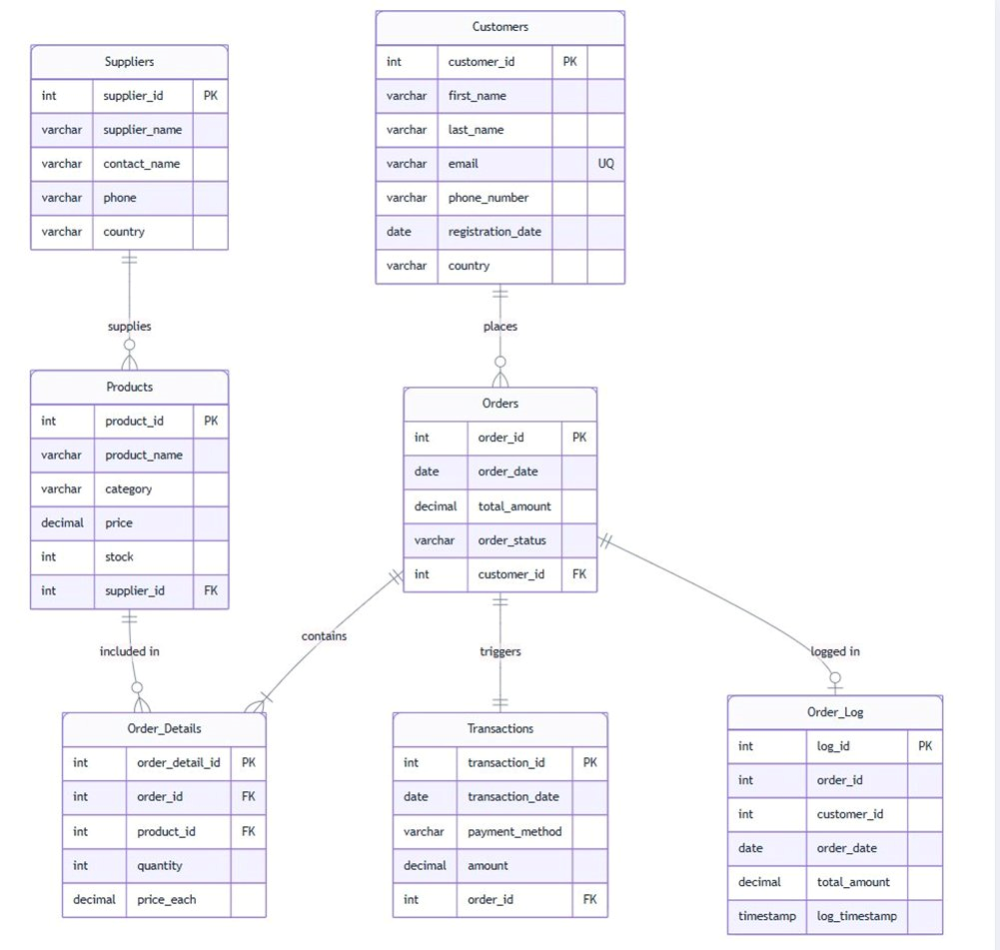

# M605 Advanced Databases — E-Commerce SQL Project

Arun Singh Chauhan | GH1052389  
GISMA University of Applied Sciences, Winter 2026

---

## Demo Video

[Watch on YouTube] : https://youtu.be/8iRR3c1aTvc

---

## What this is

This repo contains my M605 coursework — a MySQL database for an e-commerce platform, built from scratch as part of the Advanced Databases module at GISMA.

I picked e-commerce as the domain mainly because the data relationships are genuinely messy in an interesting way. Customers, orders, products, suppliers, payments — none of it sits neatly in one place, and figuring out how to structure it without things getting tangled was most of the actual work. The brief asked for at least 100 rows per table, normalization to 3NF, proper constraints, and some demonstration of transactional logic. That's what this covers.

Everything is MySQL. No frameworks, no ORM — just raw SQL.

---

## What's in here

```
├── sql/
│   └── ecommerce_full_100rows.sql   
├── diagrams/
│   └── er_diagram.png               
├── report/
│   └── final_report.pdf             
└── README.md
```

The SQL file is the main thing. It's self-contained — run it start to finish and it builds the whole database, loads the data, and executes the demonstration queries.

---

## The tables

Seven in total:

| Table | What it does |
|---|---|
| `Customers` | Names, emails, countries — basic registration stuff |
| `Suppliers` | Pulled out into its own table so we're not repeating supplier info on every product row |
| `Products` | Catalogue — price and stock both have CHECK constraints so bad data gets rejected at the schema level |
| `Orders` | One row per order, foreign keyed to a customer with ON DELETE CASCADE |
| `Order_Details` | Junction table between Orders and Products — this is what resolves the many-to-many |
| `Transactions` | Payment records |
| `Order_Log` | Audit log — a trigger writes here automatically whenever an order comes in, no manual step needed |

### ER Diagram



---

## How to run it

MySQL 8.0 or above. I used MySQL Workbench but any client should work fine.

```bash
git clone https://github.com/Arun-Singh-Chauhan-09/GH1052389-M605-Advanced-Databases.git
cd GH1052389-M605-Advanced-Databases
```

Open a query window and run:

```sql
SOURCE sql/ecommerce_full_100rows.sql;
```

That's it. Schema gets created, data loads, indexes are built, stored procedure and trigger are set up, queries run. To quickly sanity-check:

```sql
USE ecommerce_platform;
SHOW TABLES;
SELECT COUNT(*) FROM Customers;  -- should return 100
```

---

## Queries

Seven queries total. Some answer operational questions, others are more analytical — the kind of thing a business would actually want to know:

| # | What it answers | Approach |
|---|---|---|
| 1 | Which customers have orders, and what are the order details? | INNER JOIN |
| 2 | Who are the top spenders? | GROUP BY + SUM, ordered descending |
| 3 | Top 5 products by units sold | GROUP BY + LIMIT |
| 4 | Customers who've never placed a single order | LEFT JOIN, filter WHERE order_id IS NULL |
| 5 | Revenue broken down by product category | GROUP BY + SUM |
| 6 | Order count and total value by status | GROUP BY + COUNT |
| 7 | PlaceOrder procedure, trigger firing, manual transaction | Business logic |

---

## Normalization — the short version

Getting to 3NF took more back-and-forth than I expected, but the logic isn't complicated once you see it.

Suppliers being separate is the clearest example. If you put supplier phone and contact name directly inside the Products table, every product from that supplier carries a copy of that info. One supplier changes their number and you're updating it in thirty rows instead of one. Pulling it into its own table means one row, one update, done.

The Order_Details table exists for similar reasons. An order can contain multiple products. A product can appear in multiple orders. You can't model that cleanly in two tables — you need the junction table in the middle, otherwise you're either duplicating data or breaking the structure.

After that the rest of the normalization was mostly just checking that no non-key column in any table was depending on another non-key column. A couple of tables needed adjusting but nothing major.

---

## Indexes

```sql
CREATE INDEX idx_customer_country     ON Customers(country);
CREATE INDEX idx_product_category     ON Products(category);
CREATE INDEX idx_order_date           ON Orders(order_date);
CREATE INDEX idx_order_customer       ON Orders(customer_id);
CREATE INDEX idx_orderdetails_product ON Order_Details(product_id);
```

These are on the columns that kept showing up in WHERE clauses and JOIN conditions across the queries. With 100 rows the difference isn't huge, but the point is to set them up now rather than retrofit them later when the table actually has volume.

---

## PlaceOrder procedure and the trigger

### PlaceOrder

The core problem with order placement is that it touches multiple tables — you need to check stock, decrement it, insert the detail row, and update the order total. If any of that fails halfway through, you're left in an inconsistent state. Wrapping the whole thing in a stored procedure with START TRANSACTION and ROLLBACK means either all of it goes through or none of it does.

I also added a check for whether the order_id actually exists before trying to run anything, which is something I added after an early test where a call with a non-existent order silently created an orphaned detail row.

```sql
CALL PlaceOrder(5, 17, 3, 800.00);
```

### after_order_insert

Fires after every INSERT on Orders and writes to Order_Log. The reason this lives in the database as a trigger rather than in application code is that application code can be bypassed — if someone runs a query directly against the database, the application layer never sees it. The trigger runs regardless.

---

## References

- Anchlia, A., 2024. Enhancing query performance through relational database indexing. *International Journal of Computer Trends and Technology*, 72(8), pp.130–133.
- Dong, H., et al., 2024. Cloud-native databases: A survey. *IEEE Transactions on Knowledge and Data Engineering*.
- Hamouda, S., 2023. Normalization and denormalization for a document-oriented database. *ICEIS 2023*, pp.451–458.
- Kraft, P., et al., 2023. Epoxy: ACID transactions across diverse data stores. *Proceedings of the VLDB Endowment*, 16(11), pp.2742–2754.
- Pina, E., et al., 2022. NewSQL databases assessment. *Future Internet*, 15(1), p.10.

---

*Arun Singh Chauhan — GH1052389 — M605 Advanced Databases, GISMA University of Applied Sciences*
